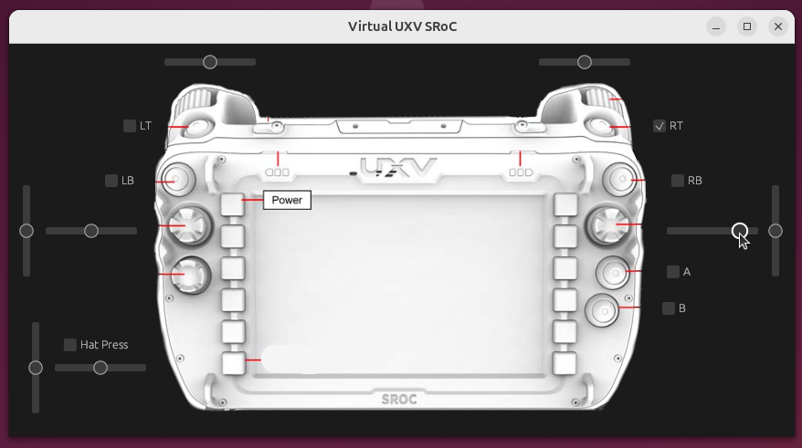

# Linux Virtual Joystick
Run a virtual joystick on your computer! 

Models a UXV SRoC device.

I use this when working with QGroundControl, which requires a joystick to be connected for certain actions. 

## Compilation
To compile from source you will need [cargo and rust](https://www.rust-lang.org/tools/install).To install from source clone this repository and `cargo build`.

## Usage
To start the program just `cargo run`.

## Notes
This is a fork of https://github.com/abezukor/linux_virtual_joystick
